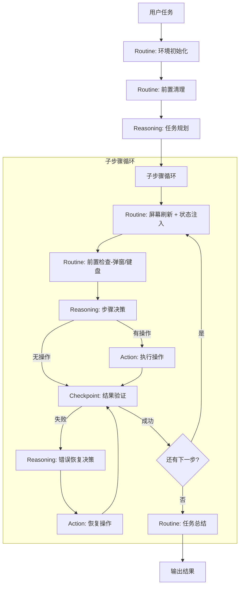

# iOSAgent 工作流优化重构方案

> 从「纯 LLM 驱动」到「固定流程 + LLM 决策」的混合架构

---

## 一、现状分析

### 1.1 当前架构：纯 ReAct 循环

```
用户任务 → [LLM 思考 → LLM 选工具 → 执行工具 → 观察结果] × N → Finish
```

当前 `iOSAgent` 继承 `ReActAgent`，每一步都完全由 LLM 决策：

| 环节 | 当前实现 | 问题 |
|------|---------|------|
| 环境感知 | LLM 决定是否调用 `observe_screen` | 屏幕状态已自动注入，但 LLM 仍可能重复调用 |
| 前置检查 | LLM 自行判断是否需要处理弹窗/键盘 | 经常忽略弹窗导致后续操作全部失败 |
| 元素定位 | LLM 从 3 种定位方式中选择 | 经常选错方式，或参数格式不对 |
| 操作执行 | LLM 选择工具并填参数 | 自由度太高，容易偏离任务 |
| 结果验证 | LLM 自行判断是否成功 | 经常"幻觉"成功，实际失败 |
| 错误恢复 | LLM 自行决定恢复策略 | 恢复策略不稳定，可能陷入死循环 |
| Tab 导航 | LLM 自行发现并使用 `get_tab_bar` | 经常忘记先 list 再 switch |

### 1.2 现有 Hook 机制评估

`ReActAgent` 已提供四个生命周期 Hook，`iOSAgent` 目前使用了全部四个：

```python
_on_loop_start(messages)          # 循环前：获取初始屏幕快照
_before_llm_call(messages)        # LLM 调用前：注入屏幕状态到 system 消息
_after_tool_execution(messages, tool_name, arguments, result)  # 工具执行后：动作工具自动刷新屏幕
_after_step(messages, step)       # 每步结束后：裁剪旧工具结果防止消息膨胀
```

**Hook 能解决的（当前已实现）：**
- 自动注入屏幕状态（`_before_llm_call`）
- 操作后自动刷新屏幕（`_after_tool_execution`）
- 消息裁剪防膨胀（`_after_step`）

**Hook 解决不了的（必须引入工作流的原因）：**
- **无法插入前置检查步骤**：Hook 是回调而非独立阶段，无法在 LLM 决策前强制插入"弹窗检测→处理"这个确定性步骤。当前弹窗处理完全依赖 LLM 自行判断，这是最大的失败来源。
- **无法控制循环结构**：Hook 只是在固定循环中触发回调，无法实现"验证失败→进入恢复流程→重试/跳过/终止"这样的分支逻辑。
- **无法跨步骤跟踪状态**：没有规划阶段，无法知道当前执行到哪个子步骤，也无法判断整体任务进度。
- **无法实现确定性门控**：无法在工具执行后强制验证结果再决定下一步，LLM 可以跳过验证直接声称完成。

**结论**：Hook 机制适合做"增强"（注入状态、裁剪消息），但无法实现"流程控制"（前置步骤、分支、验证门控）。本次改造中，已有的 Hook 逻辑会被迁移到对应的 Routine 节点中，Hook 本身作为扩展点保留。

### 1.3 PlanSolveAgent 与 WorkflowAgent 的区别

项目中已有 `PlanSolveAgent`（Planner + Executor 分离模式），在复用其设计前，需要总结其局限性：

| 问题 | 具体表现 | 对新架构的影响 |
|------|---------|--------------|
| 规划粒度不匹配 | Planner 按"信息收集→分析→结论"的逻辑步骤拆分，而非 UI 操作步骤 | PlanReasoning 必须针对设备操作场景定制 prompt，要求输出可执行的 UI 操作步骤 |
| 计划不可修正 | 一旦生成错误计划，后续步骤全部偏离且无法中途调整 | PlanReasoning 输出的计划需结构化，支持执行过程中根据实际情况动态调整 |
| 无工具感知 | Planner 不了解可用工具，生成的步骤可能无法执行 | PlanReasoning 的 prompt 需包含当前可用工具列表，确保每步都映射到可执行的工具 |
| 执行器无反馈 | 执行完一步后不验证结果，直接继续下一步 | 引入 Checkpoint 节点做步骤级验证，失败时触发恢复流程 |
| 缺乏屏幕上下文 | 规划时不知道当前屏幕状态 | PlanReasoning 执行前必须有最新的屏幕快照作为输入 |

**结论**：不复用 `PlanSolveAgent` 的代码，但借鉴其 Planner + Executor 分离的思想。新架构的 PlanReasoning 是专门为设备操作场景设计的。

### 1.4 核心痛点总结

1. **不可预测**：相同任务每次执行路径完全不同
2. **Token 浪费**：LLM 每步都要"重新理解"环境和工具
3. **稳定性差**：关键前置步骤（弹窗处理、屏幕刷新）依赖 LLM 自觉
4. **调试困难**：没有明确的阶段划分，出错时难以定位
5. **缺乏护栏**：LLM 可能跳过验证直接声称完成

---

## 二、设计目标

| 目标 | 说明 |
|------|------|
| **确定性** | 关键流程节点固定执行，不依赖 LLM 判断 |
| **可控性** | 每个阶段有明确的输入/输出/退出条件 |
| **可观测** | 每个节点的执行状态可追踪、可回放 |
| **高效性** | 减少不必要的 LLM 调用，降低 Token 消耗 |
| **灵活性** | 在需要推理的节点保留 LLM 决策能力 |

---

## 三、混合工作流架构

### 3.1 节点类型定义

```
┌──────────────────────────────────────────────────────────┐
│                      工作流节点类型                        │
├──────────────┬───────────────────────────────────────────┤
│  Routine     │ 例行节点：确定性逻辑，无需 LLM              │
│              │ 职责：环境准备、状态刷新、前置清理           │
│              │ 例：初始化设备、刷新屏幕、清理弹窗/键盘      │
├──────────────┼───────────────────────────────────────────┤
│  Reasoning   │ 推理节点：需要 LLM 推理和判断               │
│              │ 职责：任务规划、步骤决策、异常分析           │
│              │ 例：生成操作计划、决定下一步动作、恢复策略    │
├──────────────┼───────────────────────────────────────────┤
│  Checkpoint  │ 检查点节点：条件判断，决定流程走向           │
│              │ 职责：验证操作结果、检测超时、判断重试       │
│              │ 优先使用确定性验证，仅在必要时调用 LLM       │
├──────────────┼───────────────────────────────────────────┤
│  Action      │ 执行节点：执行具体工具调用                  │
│              │ 职责：将 LLM 的操作指令转化为实际工具调用    │
│              │ 支持单步执行和批量执行                      │
└──────────────┴───────────────────────────────────────────┘
```

**命名原则**：节点名称反映其在设备自动化流程中的角色——Routine 是例行公事，Reasoning 是需要思考的决策，Checkpoint 是质量关卡，Action 是实际动手操作。

### 3.2 整体工作流



### 3.3 与现有架构的对比

```
旧架构（纯 ReAct）：
  Task → LLM → Tool → LLM → Tool → ... → Finish
         ↑ 每步都是完全自由的 LLM 决策

新架构（混合工作流）：
  Task → [Init] → [Cleanup] → [Plan] → Loop([Refresh] → [PreCheck] → [Decide] → [Execute] → [Verify]) → [Summary]
         ↑ Routine ↑ Routine   ↑ Reasoning  ↑ Routine  ↑ Routine   ↑ Reasoning ↑ Action  ↑ Checkpoint
```

---

## 四、各节点详细设计

### 4.1 Routine: 环境初始化（`InitRoutine`）

**触发时机**：每次 `agent.run(task)` 调用时
**职责**：重置屏幕监听器状态并获取初始屏幕快照（WDA 连接由 `iOSAgent.connect()` 在 `run()` 之前完成）

```python
class InitRoutine:
    """环境初始化：重置屏幕监听器，获取初始屏幕状态
    
    注意：WDA 连接和会话创建由 iOSAgent.connect() 负责，
    在 run() 之前调用。InitRoutine 只做每次任务开始前的状态重置。
    """
    
    def execute(self, device_ctx: DeviceContext) -> RoutineResult:
        # 1. 重置屏幕监听器（清空上一轮任务的缓存）
        device_ctx.screen_monitor.reset()
        
        # 2. 获取初始屏幕快照
        device_ctx.screen_monitor.refresh()
        
        return RoutineResult(status="success", data={
            "initial_screen": device_ctx.screen_monitor.get_summary()
        })
```

> **迁移自**：现有 `_on_loop_start` Hook（WDA 连接保留在 `iOSAgent.connect()` 中，与现有 `main.py` 的 `connect() → run()` 调用模式一致）

### 4.2 Routine: 前置清理（`CleanupRoutine`）

**触发时机**：初始化之后、任务规划之前
**职责**：确保屏幕处于干净状态（无弹窗、无键盘遮挡）

```python
class CleanupRoutine:
    """前置清理：自动处理弹窗和键盘"""
    
    def execute(self, device_ctx: DeviceContext) -> RoutineResult:
        results = []
        
        # 1. 检测并关闭系统弹窗（Alert）
        alert_info = device_ctx.screen_monitor.detect_alert()
        if alert_info:
            result = device_ctx.wda.accept_alert()
            results.append(f"已处理弹窗: {alert_info['title']}")
            device_ctx.screen_monitor.refresh()
        
        # 2. 检测并收起键盘
        if device_ctx.screen_monitor.detect_keyboard():
            device_ctx.wda.dismiss_keyboard()
            results.append("已收起键盘")
            device_ctx.screen_monitor.refresh()
        
        return RoutineResult(status="success", data={"cleanup_actions": results})
```

> **新增节点**：当前 LLM 经常忽略弹窗导致后续操作失败，改为确定性前置处理。

### 4.3 Reasoning: 任务规划（`PlanReasoning`）

**触发时机**：环境就绪后，执行操作之前
**职责**：将用户任务分解为可执行的子步骤序列

#### 结构化输出格式

```python
class PlanReasoning:
    """任务规划：将用户任务分解为结构化的操作计划"""
    
    PLAN_SCHEMA = {
        "type": "function",
        "function": {
            "name": "generate_plan",
            "description": "为 iOS 自动化任务生成操作计划",
            "parameters": {
                "type": "object",
                "properties": {
                    "goal": {"type": "string", "description": "任务目标的一句话描述"},
                    "steps": {
                        "type": "array",
                        "items": {
                            "type": "object",
                            "properties": {
                                "id": {"type": "integer", "description": "步骤编号"},
                                "description": {"type": "string", "description": "步骤描述"},
                                "expected_screen": {"type": "string", "description": "执行后预期的屏幕状态"},
                                "tools_hint": {
                                    "type": "array",
                                    "items": {"type": "string"},
                                    "description": "建议使用的工具列表"
                                },
                                "max_retries": {"type": "integer", "description": "最大重试次数", "default": 3}
                            },
                            "required": ["id", "description", "expected_screen"]
                        }
                    }
                },
                "required": ["goal", "steps"]
            }
        }
    }
    
    def execute(self, llm_ctx: LLMContext, device_ctx: DeviceContext, task_ctx: TaskContext) -> ReasoningResult:
        # 构建 prompt，包含当前屏幕状态和可用工具
        current_screen = device_ctx.screen_monitor.get_summary()
        available_tools = task_ctx.tool_registry.list_tools()
        
        prompt = f"""你是一个 iOS 设备自动化规划专家。

## 当前屏幕状态
{current_screen}

## 可用工具
{', '.join(available_tools)}

## 任务
{task_ctx.task}

请生成一个操作计划。每个步骤必须是可通过一次工具调用完成的原子操作。
expected_screen 用于后续验证操作是否成功。"""
        
        response = llm_ctx.llm.invoke_with_tools(
            messages=[{"role": "user", "content": prompt}],
            tools=[self.PLAN_SCHEMA],
            tool_choice={"type": "function", "function": {"name": "generate_plan"}}
        )
        
        plan = json.loads(response.tool_calls[0].arguments)
        task_ctx.plan = plan
        task_ctx.current_step_index = 0
        
        return ReasoningResult(status="success", data=plan)
```

**与 PlanSolveAgent 的区别**：
- 输出结构化步骤（含 `expected_screen` 和 `tools_hint`），而非自然语言
- 规划时可感知当前屏幕状态和可用工具
- 计划在执行过程中可动态调整（见 4.7 RecoveryReasoning）

### 4.4 Routine: 屏幕刷新（`RefreshRoutine`）

**触发时机**：每个子步骤开始前
**职责**：确保 LLM 决策时看到的是最新屏幕状态

```python
class RefreshRoutine:
    """屏幕刷新：获取最新屏幕状态并注入到消息上下文"""
    
    def execute(self, device_ctx: DeviceContext, llm_ctx: LLMContext) -> RoutineResult:
        # 刷新屏幕
        xml = device_ctx.screen_monitor.refresh()
        
        # 注入到消息上下文
        llm_ctx.context_manager.inject_screen_state(
            llm_ctx.messages, device_ctx.screen_monitor
        )
        
        return RoutineResult(status="success", data={
            "snapshot_count": device_ctx.screen_monitor._snapshot_count,
            "screen_changed": device_ctx.screen_monitor.has_changed()
        })
```

> **迁移自**：`_after_tool_execution` 中的屏幕刷新 + `_before_llm_call` 中的状态注入

### 4.5 Routine: 前置检查（`PreCheckRoutine`）

**触发时机**：屏幕刷新之后、LLM 决策之前
**职责**：检测并处理可能阻塞操作的屏幕状态

```python
class PreCheckRoutine:
    """前置检查：每步操作前确保没有阻塞状态"""
    
    def execute(self, device_ctx: DeviceContext, task_ctx: TaskContext) -> RoutineResult:
        actions_taken = []
        
        # 1. 检测弹窗（Alert / 系统对话框 / 权限请求）
        alert = device_ctx.screen_monitor.detect_alert()
        if alert:
            # 系统权限弹窗 → 允许
            if alert.get("type") == "permission":
                device_ctx.wda.accept_alert()
                actions_taken.append(f"已允许权限: {alert['title']}")
            # 业务弹窗 → 关闭
            else:
                device_ctx.wda.dismiss_alert()
                actions_taken.append(f"已关闭弹窗: {alert['title']}")
            device_ctx.screen_monitor.refresh()
        
        # 2. 检测键盘（可能遮挡元素定位）
        if device_ctx.screen_monitor.detect_keyboard():
            # 根据当前步骤的 tools_hint 决定是否自动收起键盘：
            # - 如果下一步需要输入（tools_hint 包含 input_text），保留键盘
            # - 否则自动收起，避免键盘遮挡导致元素定位失败
            current_step = task_ctx.get_current_step()
            needs_input = current_step and any(
                "input" in t for t in current_step.get("tools_hint", [])
            )
            if not needs_input:
                device_ctx.wda.dismiss_keyboard()
                actions_taken.append("键盘已自动收起（当前步骤无需输入）")
                device_ctx.screen_monitor.refresh()
            else:
                actions_taken.append("键盘可见，当前步骤需要输入，保留")
        
        # 3. 检测加载状态（ActivityIndicator）
        if device_ctx.screen_monitor.is_loading():
            device_ctx.screen_monitor.refresh()  # refresh 内部会等待加载完成
            actions_taken.append("等待加载完成")
        
        return RoutineResult(status="success", data={
            "actions_taken": actions_taken,
            "screen_ready": True
        })
```

> **新增节点**：将弹窗/键盘检测从 LLM 判断改为确定性前置处理。

### 4.6 Reasoning: 步骤决策（`DecideReasoning`）

**触发时机**：前置检查通过后
**职责**：根据当前屏幕状态和计划，决定本步操作

```python
class DecideReasoning:
    """步骤决策：决定本步执行什么操作"""
    
    def execute(self, llm_ctx: LLMContext, task_ctx: TaskContext, device_ctx: DeviceContext) -> ReasoningResult:
        current_step = task_ctx.get_current_step()
        current_screen = device_ctx.screen_monitor.get_summary()
        
        # 根据步骤类型过滤可用工具，减少 LLM 选择范围
        available_tools = task_ctx.tool_filter.filter_for_step(current_step)
        
        prompt = f"""## 当前任务
{task_ctx.task}

## 操作计划
{task_ctx.format_plan_progress()}

## 当前步骤
步骤 {current_step['id']}: {current_step['description']}

## 当前屏幕
{current_screen}

## 可用工具（已根据步骤类型过滤）
{', '.join(available_tools)}

请决定本步的具体操作。如果计划中的步骤在当前屏幕上无法执行，
请说明原因并调整操作策略。"""
        
        response = llm_ctx.llm.invoke_with_tools(
            messages=llm_ctx.messages + [{"role": "user", "content": prompt}],
            tools=available_tools
        )
        
        # 提取 LLM 选择的所有工具和参数（支持批量操作）
        if response.tool_calls:
            operations = []
            for tc in response.tool_calls:
                operations.append({
                    "tool_name": tc.name,
                    "arguments": json.loads(tc.arguments),
                })
            return ReasoningResult(status="success", data={
                "operations": operations,           # 支持多个操作
                "reasoning": response.content,
            })
        
        return ReasoningResult(status="no_action", data={"reasoning": response.content})
```

**支持操作批处理**：当 LLM 在一次响应中返回多个 tool_calls 时，Action 节点会批量执行，减少不必要的中间验证循环。适用于"输入文本→点击确认"等连续操作场景。

### 4.7 Action: 执行操作（`ExecuteAction`）

**触发时机**：步骤决策完成后
**职责**：执行 LLM 指定的工具调用

```python
class ExecuteAction:
    """执行操作：调用工具注册表执行具体操作"""
    
    def execute(self, task_ctx: TaskContext, device_ctx: DeviceContext) -> ActionResult:
        operation = task_ctx.current_operation
        
        # 支持批量执行（LLM 一次返回多个 tool_calls）
        tool_calls = operation if isinstance(operation, list) else [operation]
        results = []
        
        for call in tool_calls:
            tool_name = call["tool_name"]
            arguments = call["arguments"]
            
            # 通过注册表执行工具
            response = task_ctx.tool_registry.execute_tool(tool_name, arguments)
            results.append({
                "tool_name": tool_name,
                "arguments": arguments,
                "success": response.status == "success",
                "output": response.text,
            })
            
            # 动作工具执行后刷新屏幕（复用 tools.tool_categories.is_action_tool）
            from tools.tool_categories import is_action_tool
            if is_action_tool(tool_name, arguments):
                device_ctx.screen_monitor.refresh()
        
        task_ctx.step_results = results
        return ActionResult(status="executed", data={"results": results})
```

> **批量执行优化**：当 `DecideReasoning` 返回多个操作（如 `input_text` + `tap_keyboard_return`）时，Action 节点按序执行全部操作后再统一进入 Checkpoint 验证，避免无意义的中间循环。

### 4.8 Checkpoint: 结果验证（`VerifyCheckpoint`）

**触发时机**：操作执行完成后
**职责**：验证操作是否成功，决定后续流程走向

#### 验证策略：确定性优先

```python
class VerifyCheckpoint:
    """结果验证：优先确定性验证，必要时才调用 LLM"""
    
    # 确定性验证规则（不需要 LLM）
    # 注意：以下方法部分依赖 ScreenMonitor 待新增的 API（见下方说明）
    DETERMINISTIC_CHECKS = {
        "tap_element":        "check_element_disappeared_or_page_changed",
        "input_text":         "check_input_field_has_value",
        "go_back":            "check_page_changed",
        "scroll_to_find_and_tap": "check_element_tapped_or_page_changed",
        "handle_alert":       "check_alert_dismissed",
        "restart_app":        "check_app_relaunched",
    }
    
    def execute(self, task_ctx: TaskContext, device_ctx: DeviceContext, llm_ctx: LLMContext) -> CheckpointResult:
        current_step = task_ctx.get_current_step()
        step_results = task_ctx.step_results
        
        # ---- 阶段 1：确定性验证 ----
        for result in step_results:
            tool_name = result["tool_name"]
            check_method = self.DETERMINISTIC_CHECKS.get(tool_name)
            
            if check_method and not result["success"]:
                return CheckpointResult(status="failed", reason=f"工具执行失败: {result['output']}")
            
            if check_method:
                passed = self._deterministic_check(check_method, device_ctx, result)
                if not passed:
                    return CheckpointResult(status="failed", reason=f"确定性验证未通过: {check_method}")
        
        # ---- 阶段 2：预期屏幕验证（轻量 LLM 调用）----
        expected_screen = current_step.get("expected_screen")
        if expected_screen:
            current_screen = device_ctx.screen_monitor.get_summary()
            match = self._semantic_check(llm_ctx, expected_screen, current_screen)
            if not match:
                return CheckpointResult(status="failed", reason=f"当前屏幕与预期不匹配")
        
        # ---- 判断是否全部完成 ----
        if task_ctx.is_all_steps_completed():
            return CheckpointResult(status="completed")
        
        # 推进到下一步
        task_ctx.advance_step()
        return CheckpointResult(status="passed")
    
    def _deterministic_check(self, method: str, device_ctx: DeviceContext, result: dict) -> bool:
        """确定性验证：基于屏幕 diff、元素存在性等客观条件判断
        
        依赖 ScreenMonitor 的以下 API（在 Phase 3 实现时统一添加）：
        
        | API | 来源 | 说明 |
        |-----|------|------|
        | has_changed() | 新增 | 对比前后帧 XML 是否发生变化，基于现有 `_previous_xml` 和 `detect_changes()` 扩展 |
        | element_exists(name) | 新增 | 在当前 XML 中搜索指定 name 的元素是否存在 |
        | detect_alert() | 新增 | 检测当前屏幕是否有 Alert 弹窗，供 PreCheckRoutine 和此处共用 |
        | detect_keyboard() | 新增 | 检测键盘是否可见，供 PreCheckRoutine 和此处共用 |
        | is_loading() | 新增 | 检测是否有 ActivityIndicator 等加载状态（现有 `_wait_for_loading_complete` 仅等待，不暴露检测结果） |
        
        注意：现有 ScreenMonitor 已有 `_previous_xml`（用于 `detect_changes()`）和 `_wait_for_loading_complete()`，
        新增 API 应基于这些内部状态封装为公开方法，而非重复实现。
        """
        screen = device_ctx.screen_monitor
        if method == "check_page_changed":
            return screen.has_changed()
        elif method == "check_alert_dismissed":
            return not screen.detect_alert()
        elif method == "check_element_disappeared_or_page_changed":
            return screen.has_changed() or not screen.element_exists(result["arguments"].get("name", ""))
        # ... 其他确定性检查
        return True
    
    def _semantic_check(self, llm_ctx: LLMContext, expected: str, actual: str) -> bool:
        """语义验证：用轻量 prompt 判断屏幕状态是否符合预期"""
        prompt = f"预期屏幕状态：{expected}\n实际屏幕状态：{actual}\n请判断实际状态是否基本符合预期，只回答 YES 或 NO。"
        response = llm_ctx.llm.invoke([{"role": "user", "content": prompt}])
        return "YES" in response.content.upper()
```

**设计要点**：
- **确定性验证优先**：大部分操作（点击后页面是否变化、弹窗是否消失）可以通过 `ScreenMonitor.diff()` 和元素检测来客观判断，不需要 LLM
- **语义验证兜底**：只在有 `expected_screen` 描述时才使用轻量 LLM 调用，且 prompt 极短以降低成本
- 语义验证使用**同一个 LLM**（不引入额外模型），但通过极短的 prompt 控制 Token 消耗

### 4.9 Reasoning: 错误恢复（`RecoveryReasoning`）

**触发时机**：Checkpoint 验证失败时
**职责**：分析失败原因，决定恢复策略

#### 硬性退出护栏

```python
class RecoveryReasoning:
    """错误恢复：分析失败原因并决定恢复策略"""
    
    # 硬性护栏：同一子步骤最多重试 MAX_RETRIES 次
    MAX_RETRIES_PER_STEP = 3
    # 全局最大恢复次数（防止整个任务陷入无限恢复）
    MAX_TOTAL_RECOVERIES = 10
    
    def execute(self, task_ctx: TaskContext, device_ctx: DeviceContext, llm_ctx: LLMContext) -> ReasoningResult:
        current_step = task_ctx.get_current_step()
        retry_count = task_ctx.get_retry_count(current_step["id"])
        
        # 刷新屏幕，确保恢复决策基于最新状态（Action 失败后屏幕可能已变化）
        device_ctx.screen_monitor.refresh()
        
        # ---- 硬性护栏检查 ----
        if retry_count >= self.MAX_RETRIES_PER_STEP:
            return ReasoningResult(status="skip", data={
                "reason": f"步骤 {current_step['id']} 已重试 {retry_count} 次，强制跳过"
            })
        
        if task_ctx.total_recoveries >= self.MAX_TOTAL_RECOVERIES:
            return ReasoningResult(status="abort", data={
                "reason": f"全局恢复次数已达上限 ({self.MAX_TOTAL_RECOVERIES})，终止任务"
            })
        
        # ---- LLM 分析失败原因并决定策略 ----
        current_screen = device_ctx.screen_monitor.get_summary()
        step_results = task_ctx.step_results
        
        prompt = f"""## 操作失败分析

任务：{task_ctx.task}
当前步骤：{current_step['description']}
失败原因：{task_ctx.last_failure_reason}
当前屏幕：{current_screen}
操作结果：{step_results}
已重试次数：{retry_count}/{self.MAX_RETRIES_PER_STEP}

请选择恢复策略：
1. retry：换一种方式重试当前步骤（必须说明换什么方式）
2. skip：跳过当前步骤，继续下一步
3. abort：任务无法完成，终止执行"""
        
        response = llm_ctx.llm.invoke_with_tools(
            messages=[{"role": "user", "content": prompt}],
            tools=[{
                "type": "function",
                "function": {
                    "name": "decide_recovery",
                    "parameters": {
                        "type": "object",
                        "properties": {
                            "action": {"type": "string", "enum": ["retry", "skip", "abort"]},
                            "reason": {"type": "string"},
                            "alternative_approach": {"type": "string", "description": "如果选择 retry，说明替代方案"}
                        },
                        "required": ["action", "reason"]
                    }
                }
            }],
            tool_choice={"type": "function", "function": {"name": "decide_recovery"}}
        )
        
        decision = json.loads(response.tool_calls[0].arguments)
        task_ctx.increment_recovery_count()
        
        return ReasoningResult(status=decision["action"], data=decision)
```

**护栏设计**：
- 单步骤最多重试 3 次（可配置），超过则强制跳过
- 全局恢复次数上限 10 次，防止任务陷入无限恢复
- 恢复决策通过 Function Calling 结构化输出，避免 LLM 返回不可解析的文本

**计划动态调整**：当 RecoveryReasoning 选择 `retry` 时，可以同时修改当前步骤的 `tools_hint` 和 `expected_screen`（例如换一种定位方式）。当选择 `skip` 时，TaskContext 会将被跳过的步骤标记为 `skipped` 并记录原因，SummaryRoutine 最终汇报时会列出所有被跳过的步骤。如果连续 3 个步骤都进入恢复流程，引擎会触发一次**计划重评估**：调用 PlanReasoning 基于当前屏幕状态重新生成剩余步骤的计划。

### 4.10 Routine: 任务总结（`SummaryRoutine`）

**触发时机**：所有步骤完成或任务终止时
**职责**：汇总执行结果，生成任务报告

```python
class SummaryRoutine:
    """任务总结：生成结构化的执行报告"""
    
    def execute(self, task_ctx: TaskContext) -> RoutineResult:
        report = {
            "task": task_ctx.task,
            "status": task_ctx.status,  # "completed" | "partial" | "aborted"
            "total_steps": len(task_ctx.plan.get("steps", [])),
            "completed_steps": task_ctx.current_step_index,
            "total_llm_calls": task_ctx.stats["llm_calls"],
            "total_tokens": task_ctx.stats["total_tokens"],
            "total_recoveries": task_ctx.total_recoveries,
            "step_results": task_ctx.all_step_results,
            "duration_seconds": task_ctx.elapsed_seconds(),
        }
        
        # 生成人类可读摘要
        summary_lines = [f"任务：{task_ctx.task}"]
        summary_lines.append(f"状态：{report['status']}")
        summary_lines.append(f"完成步骤：{report['completed_steps']}/{report['total_steps']}")
        summary_lines.append(f"LLM 调用：{report['total_llm_calls']} 次，Token：{report['total_tokens']}")
        if report['total_recoveries'] > 0:
            summary_lines.append(f"恢复次数：{report['total_recoveries']}")
        
        return RoutineResult(status="success", data={
            "report": report,
            "summary": "\n".join(summary_lines)
        })
```

---

## 五、工作流引擎设计

### 5.1 上下文设计（拆分为三个独立 Context）

避免单一巨型 Context 导致的高耦合，按职责拆分为三个独立上下文，节点按需注入：

```python
class DeviceContext:
    """设备上下文：WDA 连接和屏幕状态"""
    wda: WDAClient
    screen_monitor: ScreenMonitor

class TaskContext:
    """任务上下文：任务信息和执行状态"""
    task: str                           # 原始任务描述
    plan: dict                          # 结构化操作计划
    current_step_index: int             # 当前执行到第几步
    step_results: list                  # 当前步骤的执行结果
    all_step_results: list              # 所有步骤的历史结果
    total_recoveries: int               # 全局恢复次数
    stats: dict                         # 统计信息（llm_calls, total_tokens）
    tool_registry: ToolRegistry         # 工具注册表
    tool_filter: ToolFilter             # 工具过滤器（见下方说明）
    summary: str                        # 任务执行结果摘要（由 SummaryRoutine 写入）

class LLMContext:
    """LLM 上下文：模型和消息管理"""
    llm: HelloAgentsLLM
    messages: list                      # 消息历史
    context_manager: MessageContextManager
```

**节点按需注入示例**：
- `InitRoutine` 只需要 `DeviceContext`
- `PlanReasoning` 需要 `LLMContext` + `DeviceContext` + `TaskContext`
- `VerifyCheckpoint` 需要全部三个 Context
- `SummaryRoutine` 只需要 `TaskContext`

**工具过滤规则**：`ToolFilter.filter_for_step()` 根据当前步骤的 `tools_hint` 缩小 LLM 可选工具范围：

```python
class StepToolFilter:
    """按步骤过滤可用工具，减少 LLM 选择范围"""
    
    # 始终可用的工具（不受过滤影响）
    ALWAYS_AVAILABLE = {"wda_call", "observe_screen", "inspect_element"}
    
    def filter_for_step(self, step: dict) -> list:
        """根据步骤的 tools_hint 返回过滤后的工具列表
        
        规则：
        1. tools_hint 中指定的工具始终可用
        2. ALWAYS_AVAILABLE 中的工具始终可用（wda_call 是万能后备）
        3. 如果 tools_hint 为空，返回全部工具（不过滤）
        """
        hints = step.get("tools_hint", [])
        if not hints:
            return self.all_tool_schemas  # 无 hint 时不过滤
        
        filtered = set(hints) | self.ALWAYS_AVAILABLE
        return [t for t in self.all_tool_schemas if t["function"]["name"] in filtered]
```

### 5.2 节点超时机制

每个节点可配置独立的超时时间，防止单个节点卡住导致整个工作流挂起：

```python
class NodeTimeout:
    """节点超时配置
    
    默认值基于常见场景设定，可通过 Config 或环境变量覆盖。
    LLM 节点（plan/decide/recovery）的超时建议根据实际模型速度调整：
    - 快速模型（如 GPT-4o-mini）：默认 30s 足够
    - 较慢模型（如 GPT-4o / Claude）：建议调至 60-90s
    """
    DEFAULT_TIMEOUTS = {
        "init":      10.0,   # 屏幕重置超时
        "cleanup":   5.0,    # 弹窗清理超时
        "plan":      30.0,   # 任务规划超时（LLM 调用）
        "refresh":   5.0,    # 屏幕刷新超时
        "pre_check": 5.0,    # 前置检查超时
        "decide":    30.0,   # 步骤决策超时（LLM 调用）
        "execute":   15.0,   # 工具执行超时
        "verify":    15.0,   # 结果验证超时
        "recovery":  30.0,   # 恢复决策超时（LLM 调用）
        "summary":   10.0,   # 任务总结超时
    }
    
    def __init__(self, overrides: dict = None):
        """支持通过 Config 覆盖默认超时值"""
        self.timeouts = {**self.DEFAULT_TIMEOUTS, **(overrides or {})}
    
    def get(self, node_id: str) -> float:
        return self.timeouts.get(node_id, 30.0)
```

### 5.3 状态持久化

工作流引擎支持断点恢复，当 WDA 断连或进程崩溃后可从中断处继续：

```python
class WorkflowState:
    """可持久化的工作流状态"""
    task: str
    plan: dict
    current_node: str           # 当前执行到哪个节点
    current_step_index: int
    step_results: list
    total_recoveries: int
    stats: dict
    started_at: str             # ISO 时间戳
    last_updated_at: str
    
    def save(self, path: str):
        """保存状态到 JSON 文件"""
        with open(path, "w") as f:
            json.dump(asdict(self), f, indent=2, default=str)
    
    @classmethod
    def load(cls, path: str) -> "WorkflowState":
        """从 JSON 文件恢复状态"""
        with open(path) as f:
            data = json.load(f)
        return cls(**data)
```

**持久化策略**：
- 每完成一个子步骤后自动保存状态到 `.workflow_state.json`
- WDA 断连时，引擎尝试重连后从保存的状态恢复
- 任务完成或终止时清理状态文件

### 5.4 流式事件兼容

新架构的节点执行需兼容现有 `StreamEvent` 机制，确保上层 UI 和监控系统无需改动：

```python
class WorkflowEngine:
    """工作流引擎：驱动节点执行和状态转移
    
    提供同步和异步两套 API：
    - run(): 同步执行，供 WorkflowAgent._run_workflow() 直接调用
    - arun_stream(): 异步流式执行，供 WorkflowAgent._arun_workflow() 使用
    """
    
    def _inject_contexts(self, node, device_ctx, task_ctx, llm_ctx) -> dict:
        """根据节点 execute() 签名自动注入所需上下文
        
        通过 inspect.signature 检查节点的 execute 方法需要哪些参数，
        从三个 Context 中按需注入，避免每个节点都接收全部上下文。
        """
        import inspect
        sig = inspect.signature(node.execute)
        kwargs = {}
        param_map = {
            "device_ctx": device_ctx,
            "task_ctx": task_ctx,
            "llm_ctx": llm_ctx,
        }
        for name in sig.parameters:
            if name in param_map:
                kwargs[name] = param_map[name]
        return kwargs
    
    def run(self, device_ctx, task_ctx, llm_ctx) -> str:
        """同步执行工作流（阻塞直到完成）
        
        节点的 execute() 是同步方法，直接调用即可。
        超时通过 threading.Timer 或 signal 实现（此处简化为无超时）。
        """
        node_id = self._start_node
        final_result = None
        
        while node_id:
            node = self._nodes[node_id]
            print(f"  ▶ [{type(node).__name__}] {node_id}")
            
            # 注入上下文并执行节点
            kwargs = self._inject_contexts(node, device_ctx, task_ctx, llm_ctx)
            result = node.execute(**kwargs)
            
            # 保存状态
            task_ctx.save_state()
            
            # 根据结果决定下一个节点
            next_id = self._get_next_node(node_id, result.status)
            if next_id is None:
                final_result = result
            node_id = next_id
        
        return task_ctx.get("summary", "任务完成")
    
    async def arun_stream(self, device_ctx, task_ctx, llm_ctx):
        """异步流式执行工作流
        
        节点的 execute() 是同步方法，通过 run_in_executor 包装为异步。
        yield StreamEvent 供上层 UI 和监控系统消费。
        """
        node_id = self._start_node
        
        while node_id:
            node = self._nodes[node_id]
            
            # 发送节点开始事件（兼容现有 StreamEvent）
            yield StreamEvent.create(
                StreamEventType.STEP_START,
                "WorkflowEngine",
                node=node_id,
                node_type=type(node).__name__,
            )
            
            # 执行节点（带超时）
            # 节点 execute() 是同步方法，通过 run_in_executor 包装为异步
            timeout = NodeTimeout.DEFAULT_TIMEOUTS.get(node_id, 30.0)
            loop = asyncio.get_event_loop()
            # 使用默认参数捕获当前循环变量，避免闭包延迟引用问题
            kwargs = self._inject_contexts(node, device_ctx, task_ctx, llm_ctx)
            try:
                result = await asyncio.wait_for(
                    loop.run_in_executor(
                        None,
                        lambda n=node, kw=kwargs: n.execute(**kw)
                    ),
                    timeout=timeout
                )
            except asyncio.TimeoutError:
                result = NodeResult(status="timeout")
            
            # 发送节点完成事件
            yield StreamEvent.create(
                StreamEventType.STEP_FINISH,
                "WorkflowEngine",
                node=node_id,
                result=result.to_dict(),
            )
            
            # 保存状态
            task_ctx.save_state()
            
            # 根据结果决定下一个节点
            node_id = self._get_next_node(node_id, result.status)
```

### 5.5 引擎组装

```python
def build_ios_workflow() -> WorkflowEngine:
    """构建 iOSAgent 工作流"""
    engine = WorkflowEngine()
    
    # 注册节点
    engine.register_node("init",      InitRoutine())
    engine.register_node("cleanup",   CleanupRoutine())
    engine.register_node("plan",      PlanReasoning())
    engine.register_node("refresh",   RefreshRoutine())
    engine.register_node("pre_check", PreCheckRoutine())
    engine.register_node("decide",    DecideReasoning())
    engine.register_node("execute",   ExecuteAction())
    engine.register_node("verify",    VerifyCheckpoint())
    engine.register_node("recovery",  RecoveryReasoning())
    engine.register_node("summary",   SummaryRoutine())
    
    # 定义转移规则
    engine.add_transition("init",      "success",  "cleanup")       # 注意：注册名是 cleanup
    engine.add_transition("cleanup",   "success",  "plan")
    engine.add_transition("plan",      "success",  "refresh")
    
    # 子步骤循环
    engine.add_transition("refresh",   "success",  "pre_check")
    engine.add_transition("pre_check", "success",  "decide")
    engine.add_transition("decide",    "success",  "execute")
    engine.add_transition("decide",    "no_action", "verify")      # LLM 未返回工具调用 → 交给验证节点判断
    engine.add_transition("execute",   "executed", "verify")
    
    # 验证分支
    engine.add_transition("verify",    "passed",    "refresh")     # 成功 → 下一步
    engine.add_transition("verify",    "failed",    "recovery")    # 失败 → 恢复
    engine.add_transition("verify",    "completed", "summary")     # 全部完成 → 总结
    
    # 恢复分支
    engine.add_transition("recovery",  "retry",     "decide")      # 重试 → 重新决策
    engine.add_transition("recovery",  "skip",      "refresh")     # 跳过 → 下一步
    engine.add_transition("recovery",  "abort",     "summary")     # 终止 → 总结
    
    engine.set_start("init")
    return engine
```

**循环终止条件汇总**：工作流中的子步骤循环通过以下机制保证一定会终止：

| 终止条件 | 触发位置 | 说明 |
|---------|---------|------|
| 所有步骤完成 | VerifyCheckpoint 返回 `completed` | 正常完成路径 |
| 单步骤重试耗尽 | RecoveryReasoning 返回 `skip` | 强制跳过当前步骤，继续下一步 |
| 全局恢复次数耗尽 | RecoveryReasoning 返回 `abort` | 终止整个任务 |
| 计划重评估 | 连续 3 步进入恢复 | 重新规划剩余步骤 |
| 全局步数上限 | WorkflowEngine 检测 `task_ctx.max_steps` | 兜底保护，防止任何路径下的无限循环 |
| 节点超时 | WorkflowEngine 的 `asyncio.wait_for` | 单节点卡住时强制终止 |

---

## 六、WorkflowAgent 基类设计

### 6.1 继承关系

`WorkflowAgent` 是一个全新的 Agent 基类，直接继承 `Agent`，**不继承 `ReActAgent` 或 `PlanSolveAgent`**：

```
hello_agents/core/agent.py: Agent (基类)
├── ReActAgent          ← 通用 ReAct 循环，保持不变
├── PlanSolveAgent      ← 规划+执行（无工具循环），保持不变
├── ReflectionAgent     ← 反思式 Agent，保持不变
├── SimpleAgent         ← 简单 Agent，保持不变
└── WorkflowAgent (新增) ← 结构化工作流引擎
    └── iOSAgent (agent.py)
```

**为什么不继承 ReActAgent？**
- ReActAgent 的核心是 `_run_impl` 中的"LLM 全权决策"自由循环（`while current_step < max_steps`），每个循环步骤都由 LLM 决定调用什么工具
- WorkflowAgent 要打破这个循环，用固定节点编排流程（Routine → Reasoning → Action → Checkpoint）
- 如果继承 ReActAgent，需要大量覆写内部方法（`_run_impl`、`_execute_tools`、`_build_tool_schemas` 等），与父类循环逻辑冲突，不如直接从 `Agent` 开始

**为什么不继承 PlanSolveAgent？**
- PlanSolveAgent 的 Executor 每步只做一次 LLM 调用，没有工具调用循环
- 没有屏幕刷新、前置检查、结果验证等机制
- 它的 Planner 思路可以借鉴，但代码结构不适合复用

### 6.2 基类实现

```python
class WorkflowAgent(Agent):
    """
    WorkflowAgent - 基于结构化工作流的 Agent 基类

    与 ReActAgent 的区别：
    - ReActAgent: 每步都是 LLM 自由决策的 ReAct 循环
    - WorkflowAgent: 由 WorkflowEngine 驱动固定节点编排，LLM 只在 Reasoning 节点参与

    与 PlanSolveAgent 的区别：
    - PlanSolveAgent: 规划后每步只做一次 LLM 调用，无工具循环
    - WorkflowAgent: 规划后每步进入结构化循环（Routine → Reasoning → Action → Checkpoint）

    继承自 Agent 基类，复用：
    - HistoryManager: 历史管理
    - ObservationTruncator: 工具输出截断
    - TraceLogger: 可观测性
    - ToolRegistry: 工具管理
    - SkillLoader: 知识外化
    """

    def __init__(
        self,
        name: str,
        llm: HelloAgentsLLM,
        workflow: WorkflowEngine,
        tool_registry: Optional[ToolRegistry] = None,
        system_prompt: Optional[str] = None,
        config: Optional[Config] = None,
        max_steps: int = 30,
    ):
        super().__init__(name, llm, system_prompt, config, tool_registry=tool_registry)
        self.workflow = workflow
        self.max_steps = max_steps

    def run(self, task: str, **kwargs) -> str:
        """
        执行工作流任务

        子类应覆写此方法以构建特定的 DeviceContext / TaskContext / LLMContext，
        然后调用 _run_workflow() 驱动引擎执行。

        Args:
            task: 用户任务描述

        Returns:
            任务执行结果摘要
        """
        raise NotImplementedError("子类应实现 run() 方法")

    def _run_workflow(
        self,
        device_ctx: 'DeviceContext',
        task_ctx: 'TaskContext',
        llm_ctx: 'LLMContext',
    ) -> str:
        """
        驱动工作流引擎执行（同步版本）

        内部使用 asyncio.run() 驱动异步的 WorkflowEngine.run()。
        如果调用方已在事件循环中，应改用 _arun_workflow()。

        Args:
            device_ctx: 设备上下文（WDA、屏幕监听器）
            task_ctx: 任务上下文（任务描述、计划、状态）
            llm_ctx: LLM 上下文（模型、消息、上下文管理器）

        Returns:
            任务执行结果摘要
        """
        task_ctx.max_steps = self.max_steps

        # 同步入口：直接调用引擎的同步 run() 方法
        final_result = self.workflow.run(device_ctx, task_ctx, llm_ctx)

        # 更新会话元数据
        self._session_metadata["total_steps"] = task_ctx.current_step_index
        self._session_metadata["total_tokens"] = task_ctx.stats.get("total_tokens", 0)
        self._session_metadata["total_llm_calls"] = task_ctx.stats.get("llm_calls", 0)
        self._session_metadata["total_recoveries"] = task_ctx.total_recoveries

        return final_result

    async def _arun_workflow(
        self,
        device_ctx: 'DeviceContext',
        task_ctx: 'TaskContext',
        llm_ctx: 'LLMContext',
    ) -> str:
        """
        驱动工作流引擎执行（异步版本）

        适用于已在事件循环中运行的场景，直接 await 异步引擎。
        如需流式事件，子类应覆写 arun() 并使用 stream=True。

        Returns:
            任务执行结果摘要
        """
        task_ctx.max_steps = self.max_steps

        # 异步入口：使用 arun_stream() 并消费所有事件
        # 引擎会在 summary 节点执行完毕后将结果写入 task_ctx.summary
        async for event in self.workflow.arun_stream(device_ctx, task_ctx, llm_ctx):
            pass  # 事件已通过 StreamEvent 机制分发，此处只需等待完成

        self._session_metadata["total_steps"] = task_ctx.current_step_index
        self._session_metadata["total_tokens"] = task_ctx.stats.get("total_tokens", 0)
        self._session_metadata["total_llm_calls"] = task_ctx.stats.get("llm_calls", 0)
        self._session_metadata["total_recoveries"] = task_ctx.total_recoveries

        return task_ctx.summary

    async def arun(self, task: str, **kwargs) -> str:
        """
        异步执行工作流任务

        覆写基类 arun()，构建 Context 后调用 _arun_workflow()。
        子类应覆写此方法以构建特定的 DeviceContext / TaskContext / LLMContext。

        Returns:
            任务执行结果摘要
        """
        raise NotImplementedError(
            "子类应实现 arun()，构建 Context 后调用 _arun_workflow()"
        )
```

### 6.3 与 ReActAgent 的能力对比

```
┌─────────────────────────────────────────────────────────────────┐
│ 能力                    ReActAgent          WorkflowAgent       │
├─────────────────────────────────────────────────────────────────┤
│ 执行循环                LLM 自由循环         引擎驱动固定节点     │
│ 每步谁决策              LLM 全权决策         节点类型决定         │
│ 前置检查（弹窗/键盘）    无（靠 LLM 自觉）    Routine 节点确定性执行│
│ 结果验证                LLM 自行判断         Checkpoint 确定性优先 │
│ 错误恢复                LLM 自由决策         Reasoning + 硬性护栏  │
│ 工具选择范围            全部工具             按步骤类型过滤       │
│ 操作批处理              不支持               支持（多 tool_calls） │
│ 断点恢复                不支持               支持（状态持久化）    │
│ 执行路径可预测性         低                  高                   │
└─────────────────────────────────────────────────────────────────┘
```

### 6.4 iOSAgent 集成示例

```python
from hello_agents.agents.workflow_agent import WorkflowAgent
from hello_agents.agents.workflow_engine import WorkflowEngine, build_ios_workflow

class iOSAgent(WorkflowAgent):
    """iOS 自动化 Agent — 基于混合工作流"""

    def __init__(self, wda_url="http://localhost:8100", llm=None, max_steps=30):
        self.wda = WDAClient(wda_url)
        self.screen_monitor = ScreenMonitor(self.wda)
        self.context_manager = MessageContextManager(
            screen_token_budget=8000,
            use_summary=True,
            inject_mode="summary",
        )

        # 构建 LLM（与现有 agent.py 保持一致）
        if llm is None:
            llm = HelloAgentsLLM(
                model=os.getenv("LLM_MODEL_ID"),
                api_key=os.getenv("LLM_API_KEY"),
                base_url=os.getenv("LLM_BASE_URL"),
            )

        registry = build_tool_registry(self.wda, self.screen_monitor)
        workflow = build_ios_workflow()

        super().__init__(
            name="iOSAgent",
            llm=llm,
            workflow=workflow,
            tool_registry=registry,
            system_prompt=IOS_AGENT_SYSTEM_PROMPT,
            max_steps=max_steps,
        )

    def _build_contexts(self, task: str):
        """构建三个独立上下文（供 run 和 arun 共用）"""
        device_ctx = DeviceContext(wda=self.wda, screen_monitor=self.screen_monitor)
        task_ctx = TaskContext(task=task, tool_registry=self.tool_registry)
        llm_ctx = LLMContext(
            llm=self.llm,
            messages=[],
            context_manager=self.context_manager,
        )
        return device_ctx, task_ctx, llm_ctx

    def run(self, task: str) -> str:
        device_ctx, task_ctx, llm_ctx = self._build_contexts(task)
        return self._run_workflow(device_ctx, task_ctx, llm_ctx)

    async def arun(self, task: str, **kwargs) -> str:
        device_ctx, task_ctx, llm_ctx = self._build_contexts(task)
        return await self._arun_workflow(device_ctx, task_ctx, llm_ctx)
```

---

## 七、与现有代码的集成方案

### 7.1 渐进式改造路径

```
Phase 1: 抽取 Routine 节点（低风险，高收益）
  ├── 将 _on_loop_start → InitRoutine
  ├── 将 _after_tool_execution 中的屏幕刷新 → RefreshRoutine
  ├── 新增 CleanupRoutine（弹窗/键盘自动清理）
  ├── 新增 PreCheckRoutine（每步前置检查）
  └── 验证：在 10 个标准任务上对比弹窗处理成功率

Phase 2: 引入 PlanReasoning（中风险，高收益）
  ├── 实现 PlanReasoning（不复用 PlanSolveAgent，见 1.3 节分析）
  ├── 在 run() 开头增加规划阶段
  ├── 将 ReAct 循环改为按计划逐步执行
  └── 验证：在 10 个标准任务上对比任务完成率

Phase 3: 引入 Checkpoint 节点（中风险，中收益）
  ├── 新增 VerifyCheckpoint（操作结果验证，确定性优先）
  ├── 新增 RecoveryReasoning（错误恢复决策，带硬性护栏）
  ├── 替换原有的 max_steps 硬限制为智能终止
  └── 验证：在 10 个标准任务上对比幻觉成功率

Phase 4: 完整工作流引擎（高风险，高收益）
  ├── 实现 WorkflowEngine
  ├── 将所有节点组装为工作流图
  ├── 实现状态持久化和断点恢复
  ├── iOSAgent 从 ReActAgent 改为 WorkflowAgent
  └── 验证：在 20 个标准任务上全面对比所有指标
```

> **Phase 4 可选性说明**：Phase 1-3 可在现有 ReActAgent 的 Hook 机制上实现（将 Routine/Checkpoint 逻辑嵌入 Hook），不一定需要完整的状态机引擎。建议 Phase 3 完成后根据实际收益数据决定是否引入 WorkflowEngine。

### 7.2 兼容性设计

完整的 `iOSAgent` 集成示例见 6.4 节。此处仅说明与现有代码的兼容要点：

- **工具层零改动**：`tools/` 下的所有工具类（`TapElement`、`ObserveScreen` 等）保持不变，通过 `build_tool_registry()` 原样注册到 `TaskContext.tool_registry`
- **ScreenMonitor 渐进扩展**：Phase 1-2 使用现有 API（`refresh()`、`get_screen_state()`、`detect_changes()`），Phase 3 新增 `has_changed()`、`element_exists()`、`detect_alert()`、`detect_keyboard()`、`is_loading()`
- **MessageContextManager 复用**：`LLMContext.context_manager` 直接使用现有实例，屏幕状态注入逻辑不变
- **Hook 机制保留**：`WorkflowAgent` 不继承 `ReActAgent`，因此 Hook 不再触发。原有 Hook 逻辑已迁移到对应的 Routine 节点中（见 4.1、4.4 节的迁移说明）

---

## 八、预期收益与测量方法

### 8.1 指标定义

| 指标 | 测量方法 | 基线采集 |
|------|---------|---------|
| LLM 调用次数 | 工作流引擎统计每个任务的 LLM 调用次数 | Phase 1 前，在 10 个标准任务上采集当前数据 |
| Token 消耗 | 累加每次 LLM 调用的 prompt_tokens + completion_tokens | 同上 |
| 弹窗失败率 | 10 个含弹窗场景的任务中，因弹窗未处理导致任务失败的比例 | 同上 |
| 幻觉成功率 | 人工审核 LLM 声称完成但实际未完成的任务比例 | 同上 |
| 任务完成率 | 任务实际结果与预期结果一致的比例（人工审核） | 同上 |

### 8.2 预期收益

| 指标 | 预期改善 | 说明 |
|------|---------|------|
| LLM 调用次数 | ↓ 30-40% | Routine 节点替代部分 LLM 调用，但 PlanReasoning + VerifyCheckpoint 会新增调用 |
| Token 消耗 | ↓ 30-40% | 工具过滤减少每次 prompt 大小，VerifyCheckpoint 的轻量 prompt 控制新增消耗 |
| 弹窗失败率 | ↓ 60-80% | CleanupRoutine + PreCheckRoutine 确定性处理弹窗 |
| 幻觉成功率 | ↓ 50-70% | VerifyCheckpoint 的确定性验证可过滤大部分幻觉 |
| 任务执行可预测性 | 显著提升 | 固定流程确保关键步骤不被跳过 |
| 调试定位效率 | 显著提升 | 节点级日志可精确定位失败阶段 |

> **注意**：预期值相比初版有所下调，因为新增的 PlanReasoning、VerifyCheckpoint、RecoveryReasoning 节点本身也消耗 LLM 调用和 Token。净收益主要来自减少 ReAct 循环中的无效重试和错误恢复。

### 8.3 阶段性验证计划

```
Phase 1 完成后：
  └── 在 10 个标准任务上对比：弹窗处理成功率、LLM 调用次数

Phase 2 完成后：
  └── 在 10 个标准任务上对比：任务完成率、执行路径一致性

Phase 3 完成后：
  └── 在 10 个标准任务上对比：幻觉成功率、恢复成功率

Phase 4 完成后（如执行）：
  └── 在 20 个标准任务上全面对比所有指标
```

---

## 九、风险与缓解

| 风险 | 影响 | 缓解措施 |
|------|------|---------|
| PlanReasoning 生成错误计划 | 后续步骤全部偏离 | 计划输出结构化可审查；执行中可根据实际屏幕状态动态调整计划 |
| 工具过滤过于激进 | 遗漏必要工具 | 保留 `wda_call` 作为万能后备工具；过滤规则可配置 |
| VerifyCheckpoint 增加延迟 | 每步多一次验证 | 确定性验证优先（无 LLM 调用），仅在有 `expected_screen` 时使用轻量语义验证 |
| 工作流过于刚性 | 无法处理意外场景 | RecoveryReasoning 保留 LLM 自由决策能力；支持操作批处理减少不必要的循环 |
| RecoveryReasoning 陷入死循环 | 同一问题反复重试 | 硬性护栏：单步骤最多重试 3 次，全局最多恢复 10 次 |
| 节点超时导致操作中断 | 正在执行的工具被强制终止 | 超时配置可调；超时后进入 RecoveryReasoning 而非直接失败 |
| WorkflowEngine 自身故障 | 整个工作流无法运行 | Phase 1-3 可独立于 WorkflowEngine 实现（基于现有 Hook 机制扩展） |
| 改造工作量大 | 开发周期长 | 分 4 个 Phase 渐进式改造，每个 Phase 独立可验证 |

---

## 十、总结

本方案的核心思想是 **"确定性兜底，LLM 决策增强"**：

1. **Routine 节点**处理所有不需要推理的确定性操作（初始化、刷新、清理、检查），从现有 Hook 机制迁移而来
2. **Reasoning 节点**只在真正需要推理的地方使用（规划、决策、恢复），输出结构化格式便于引擎跟踪
3. **Checkpoint 节点**提供质量关卡，优先使用确定性验证（屏幕 diff、元素检测），仅在必要时调用轻量 LLM 语义验证
4. **Action 节点**忠实执行 LLM 的操作指令，支持批量执行以减少不必要的中间循环

**与初版方案的关键改进**：
- 节点命名更贴合设备自动化场景（Routine / Reasoning / Checkpoint / Action）
- 补充了现有 Hook 机制的差距分析，明确了什么必须改、什么可以复用
- 总结了 PlanSolveAgent 的经验教训，避免重复踩坑
- 上下文拆分为 DeviceContext / TaskContext / LLMContext，降低耦合
- Checkpoint 验证采用确定性优先策略，缓解"验证本身消耗 LLM"的矛盾
- RecoveryReasoning 增加硬性退出护栏，防止死循环
- 支持操作批处理，避免连续简单操作的不必要延迟
- 增加节点超时和状态持久化设计，提高容错能力
- 收益指标附带测量方法和阶段性验证计划，不再依赖主观估计
- Phase 4 标记为可选，Phase 1-3 可基于现有 Hook 机制独立实现
