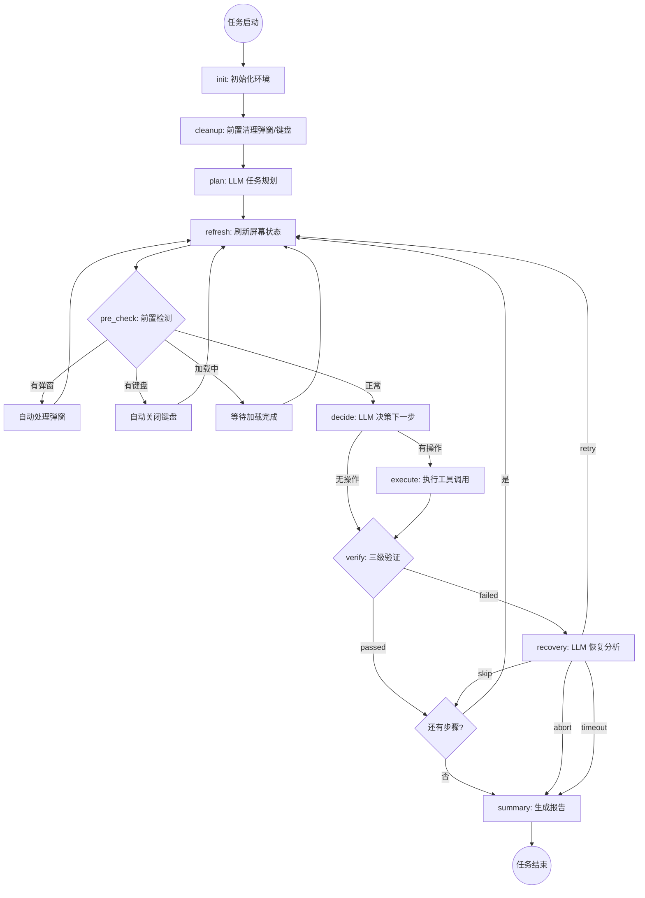
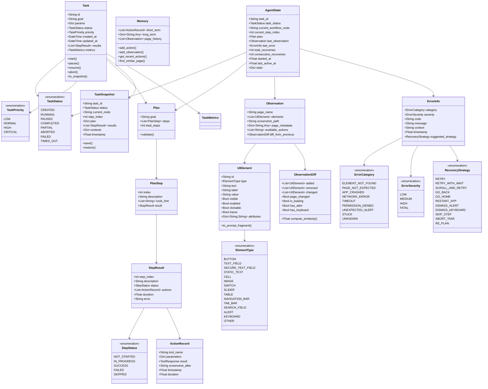

增强型 Agent 主循环

```mermaid
graph TD
    START((任务启动)) --> INIT[init: 初始化环境]
    INIT --> CLEANUP[cleanup: 前置清理弹窗/键盘]
    CLEANUP --> PLAN[plan: LLM 任务规划]
    PLAN --> REFRESH[refresh: 刷新屏幕状态]

    REFRESH --> PRE_CHECK{pre_check: 前置检测}
    PRE_CHECK -->|有弹窗| HANDLE_ALERT[自动处理弹窗]
    HANDLE_ALERT --> REFRESH
    PRE_CHECK -->|有键盘| DISMISS_KEYBOARD[自动关闭键盘]
    DISMISS_KEYBOARD --> REFRESH
    PRE_CHECK -->|加载中| WAIT_LOADING[等待加载完成]
    WAIT_LOADING --> REFRESH
    PRE_CHECK -->|正常| DECIDE

    DECIDE[decide: LLM 决策下一步] -->|有操作| EXECUTE
    DECIDE -->|无操作| VERIFY

    EXECUTE[execute: 执行工具调用] --> VERIFY

    VERIFY{verify: 三级验证}
    VERIFY -->|passed| NEXT_STEP{还有步骤?}
    NEXT_STEP -->|是| REFRESH
    NEXT_STEP -->|否| SUMMARY
    VERIFY -->|failed| RECOVERY

    RECOVERY[recovery: LLM 恢复分析]
    RECOVERY -->|retry| REFRESH
    RECOVERY -->|skip| NEXT_STEP
    RECOVERY -->|abort| SUMMARY
    RECOVERY -->|timeout| SUMMARY

    SUMMARY[summary: 生成报告] --> END((任务结束))
```

对象模型全景图

```mermaid
classDiagram
    class Task {
        +String id
        +String goal
        +Dict params
        +TaskStatus status
        +TaskPriority priority
        +DateTime created_at
        +DateTime updated_at
        +List~StepResult~ results
        +TaskMetrics metrics
        +start()
        +pause()
        +resume()
        +abort()
        +to_snapshot()
    }

    class TaskStatus {
        <<enumeration>>
        CREATED
        RUNNING
        PAUSED
        COMPLETED
        PARTIAL
        ABORTED
        FAILED
        TIMED_OUT
    }

    class TaskPriority {
        <<enumeration>>
        LOW
        NORMAL
        HIGH
        CRITICAL
    }

    class TaskSnapshot {
        +String task_id
        +TaskStatus status
        +String current_node
        +Int step_index
        +Dict plan
        +List~StepResult~ results
        +Dict contexts
        +Float timestamp
        +save()
        +restore()
    }

    class Plan {
        +String goal
        +List~PlanStep~ steps
        +Int total_steps
        +validate()
    }

    class PlanStep {
        +Int index
        +String description
        +List~String~ tools_hint
        +StepResult result
    }

    class StepResult {
        +Int step_index
        +String description
        +StepStatus status
        +List~ActionRecord~ actions
        +Float duration
        +String error
    }

    class StepStatus {
        <<enumeration>>
        NOT_STARTED
        IN_PROGRESS
        SUCCESS
        FAILED
        SKIPPED
    }

    class ActionRecord {
        +String tool_name
        +Dict parameters
        +ToolResponse result
        +String screenshot_after
        +Float timestamp
        +Float duration
    }

    class Observation {
        +String page_name
        +List~UIElement~ elements
        +String screenshot_path
        +Dict~String,Any~ page_metadata
        +List~String~ available_actions
        +ObservationDiff diff_from_previous
    }

    class ObservationDiff {
        +List~UIElement~ added
        +List~UIElement~ removed
        +List~UIElement~ changed
        +Bool page_changed
        +Bool is_loading
        +Bool has_alert
        +Bool has_keyboard
        +Float compute_similarity()
    }

    class UIElement {
        +String id
        +ElementType type
        +String text
        +String label
        +String value
        +Bool visible
        +Bool enabled
        +Bool clickable
        +Rect frame
        +Dict~String,String~ attributes
        +to_prompt_fragment()
    }

    class ElementType {
        <<enumeration>>
        BUTTON
        TEXT_FIELD
        SECURE_TEXT_FIELD
        STATIC_TEXT
        CELL
        IMAGE
        SWITCH
        SLIDER
        TABLE
        NAVIGATION_BAR
        TAB_BAR
        SEARCH_FIELD
        ALERT
        KEYBOARD
        OTHER
    }

    class ErrorInfo {
        +ErrorCategory category
        +ErrorSeverity severity
        +String code
        +String message
        +String context
        +Float timestamp
        +RecoveryStrategy suggested_strategy
    }

    class ErrorCategory {
        <<enumeration>>
        ELEMENT_NOT_FOUND
        PAGE_NOT_EXPECTED
        APP_CRASHED
        NETWORK_ERROR
        TIMEOUT
        PERMISSION_DENIED
        UNEXPECTED_ALERT
        STUCK
        UNKNOWN
    }

    class ErrorSeverity {
        <<enumeration>>
        LOW
        MEDIUM
        HIGH
        FATAL
    }

    class RecoveryStrategy {
        <<enumeration>>
        RETRY
        RETRY_WITH_WAIT
        SCROLL_AND_RETRY
        GO_BACK
        GO_HOME
        RESTART_APP
        DISMISS_ALERT
        DISMISS_KEYBOARD
        SKIP_STEP
        ABORT_TASK
        RE_PLAN
    }

    class Memory {
        +List~ActionRecord~ short_term
        +Dict~String,Any~ long_term
        +List~Observation~ page_history
        +add_action()
        +add_observation()
        +get_recent_actions()
        +find_similar_page()
    }

    class AgentState {
        +String task_id
        +TaskStatus task_status
        +String current_workflow_node
        +Int current_step_index
        +Plan plan
        +Observation last_observation
        +ErrorInfo last_error
        +Int total_recoveries
        +Int consecutive_recoveries
        +Float started_at
        +Float last_active_at
        +Dict stats
    }

    Task --> TaskStatus
    Task --> TaskPriority
    Task --> Plan
    Task --> TaskSnapshot
    Task --> TaskMetrics
    Plan --> PlanStep
    PlanStep --> StepResult
    StepResult --> StepStatus
    StepResult --> ActionRecord
    Observation --> UIElement
    Observation --> ObservationDiff
    UIElement --> ElementType
    ErrorInfo --> ErrorCategory
    ErrorInfo --> ErrorSeverity
    ErrorInfo --> RecoveryStrategy
    AgentState --> TaskStatus
    AgentState --> Plan
    AgentState --> Observation
    AgentState --> ErrorInfo
```